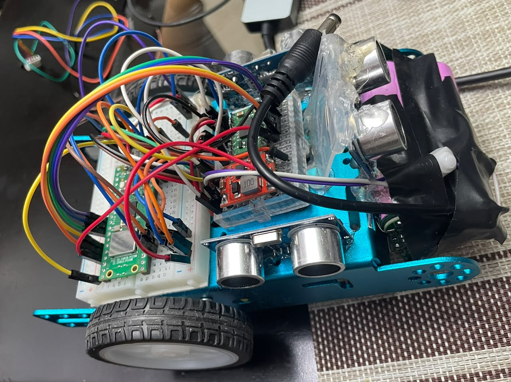
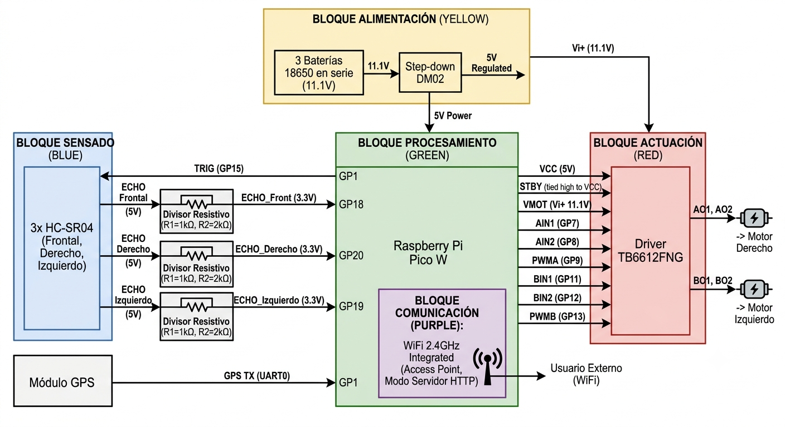
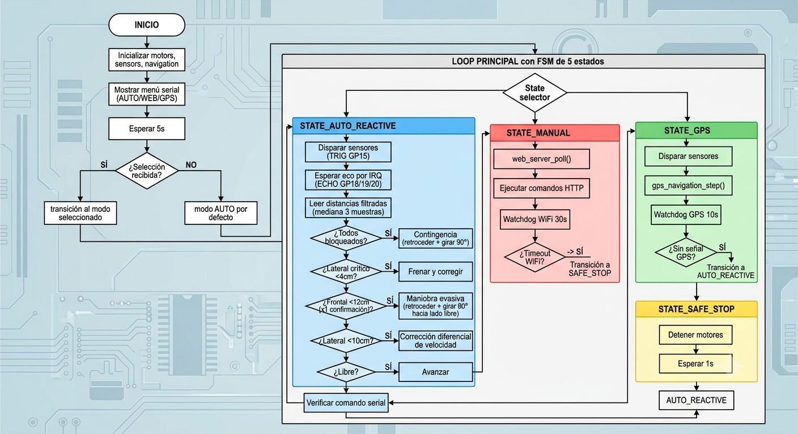
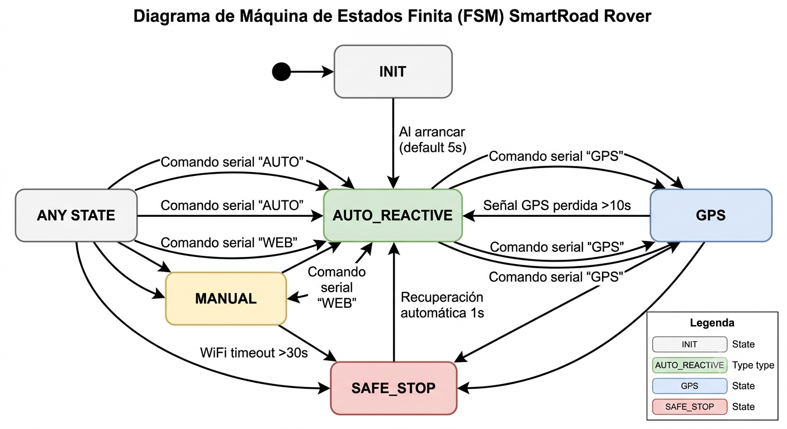

# SmartRoad Rover

Robot móvil autónomo basado en Raspberry Pi Pico W, desarrollado como proyecto final para el curso **Electrónica Digital III** — Universidad de Antioquia, 2026.

**Estudiante:** Juan Felipe Orozco Londoño  
**Equipo:** Boole  
**Repositorio:** https://github.com/juanforozco/smartroad-rover

---

<p align="center">
  
</p>

---

## Descripción del sistema final

SmartRoad Rover es una plataforma robótica móvil que navega de forma autónoma evitando obstáculos en tiempo real, implementada sobre un chasis 2WD con el microcontrolador Raspberry Pi Pico W. El sistema integra percepción del entorno mediante tres sensores ultrasónicos HC-SR04, procesamiento en tiempo real con arquitectura Polling + IRQ, control de motores DC vía PWM de hardware, y una máquina de estados finita (FSM) que gestiona tres modos de operación seleccionables por el usuario.

La implementación física se realizó sobre protoboard como prototipo funcional de validación académica, decisión justificada por los tiempos del proyecto y la necesidad de iteración rápida durante el desarrollo del firmware.

---

## Modos de operación

### Modo autónomo reactivo *(principal — implementado y funcionando)*

El rover se desplaza de forma independiente usando los tres sensores HC-SR04 para detectar obstáculos y ejecutar maniobras de evasión en tiempo real. La arquitectura de sensado usa IRQ GPIO en ambos flancos del pin ECHO para capturar el tiempo de vuelo con precisión de microsegundos, mientras el disparo TRIG es síncrono desde el loop principal (Polling). Un filtro de mediana de 3 muestras descarta lecturas espurias.

**Algoritmo de navegación (prioridades):**
1. Todos los sensores bloqueados → contingencia: retroceder + girar 90° derecha
2. Lateral crítico < 4 cm → frenar y corregir inmediatamente
3. Frontal bloqueado (confirmado) → maniobra evasiva: retroceder + girar 90° hacia lado libre
4. Lateral cercano < 10 cm → corrección diferencial de velocidad sin frenar
5. Camino libre → avanzar

### Modo manual via WiFi *(implementado — limitaciones de conectividad)*

El Pico W genera una red WiFi en modo Access Point (SSID: SmartRoad-Rover, contraseña: rover1234). Un servidor HTTP embebido sobre lwIP sirve una interfaz web con controles de movimiento accesible en http://192.168.4.1. Durante las pruebas se logró establecer conexión desde PC pero con limitaciones de configuración de IP en el Access Point que impidieron la conexión desde dispositivos móviles. Se identifica como oportunidad de mejora para versiones futuras.

### Modo autónomo asistido por GPS *(implementado — dependiente de señal satelital)*

El módulo GPS recibe tramas NMEA por UART0 usando DMA con DREQ_UART0_RX, sin intervención del CPU durante la recepción. El sistema calcula la distancia al objetivo mediante la fórmula de Haversine y navega hacia él manteniendo activa la detección de obstáculos. En pruebas en interiores no se obtuvo señal satelital. El modo está completamente implementado y funcional en su lógica; su operación efectiva requiere condiciones de cielo abierto.

---

## Arquitectura del hardware

<p align="center">
  
</p>

### Componentes del prototipo final

| Componente | Descripción |
|---|---|
| Raspberry Pi Pico W | Microcontrolador principal con WiFi integrado |
| HC-SR04 × 3 | Sensores ultrasónicos — frontal (GP20), derecho (GP18), izquierdo (GP19) |
| TB6612FNG | Driver dual de motores DC |
| GY-GPS6MV2 | Módulo GPS con antena externa — UART0 RX en GP1 |
| Chasis 2WD | Plataforma mecánica con dos motores DC |
| 3 × 18650 en serie | Batería ~11.1V — alimentación del sistema |
| Step-down DM02-28050016DS | Regulador 11.1V → 5V para lógica |
| Protoboard | Implementación física del circuito |

### Asignación de pines GPIO

| Señal | GPIO | Dirección |
|---|---|---|
| TRIG × 3 sensores (compartido) | GP15 | Salida |
| ECHO sensor derecho | GP18 | Entrada (divisor de tensión) |
| ECHO sensor centro | GP20 | Entrada (divisor de tensión) |
| ECHO sensor izquierdo | GP19 | Entrada (divisor de tensión) |
| AIN1 Motor A (izquierdo) | GP7 | Salida digital |
| AIN2 Motor A (izquierdo) | GP8 | Salida digital |
| PWMA Motor A (izquierdo) | GP9 | Salida PWM |
| BIN1 Motor B (derecho) | GP11 | Salida digital |
| BIN2 Motor B (derecho) | GP12 | Salida digital |
| PWMB Motor B (derecho) | GP13 | Salida PWM |
| GPS TX → Pico RX | GP1 | UART0 RX |

### Circuitos analógicos

Cada pin ECHO del HC-SR04 (5V) pasa por un divisor resistivo antes del GPIO del Pico W (máx. 3.3V):

```
ECHO (5V) → R1=1kΩ → nodo → GPIO Pico W
                    → R2=2kΩ → GND
Vout = 5V × 2000/3000 = 3.33V
```

---

## Arquitectura del firmware

<p align="center">
  
</p>

### Paradigma de programación: Polling + IRQ

El firmware implementa el paradigma **Polling + IRQ** sobre C con el Pico SDK oficial:

- **IRQ (interrupciones):** los tres pines ECHO tienen IRQ en flanco de subida y bajada. En flanco de subida se captura `time_us_32()` como inicio del pulso. En flanco de bajada se calcula la distancia y se actualiza el buffer circular.
- **Polling:** el loop principal dispara el TRIG de forma síncrona y ejecuta el ciclo de navegación. No hay RTOS.
- **PWM de hardware:** los motores usan PWM generado por el periférico PWM del RP2040 a 20kHz, sin intervención del CPU.
- **DMA:** el GPS usa un canal DMA con DREQ_UART0_RX para recibir tramas NMEA sin intervención del CPU.
- **Repeating timer:** usado para el selector de modo serial en versiones con FSM activa.

### Máquina de estados finita (FSM)

<p align="center">
  
</p>

### Estructura modular del firmware

```
firmware/smartroad-rover/
├── smartroad-rover.c      # Main: loop principal modo autónomo
├── src/
│   ├── motors.c           # Control PWM motores DC via TB6612FNG
│   ├── sensors.c          # Lectura HC-SR04: TRIG polling, ECHO IRQ, filtro mediana
│   ├── navigation.c       # Algoritmo de evasión autónoma con prioridades
│   ├── fsm.c              # FSM: 5 estados, selector serial, transiciones
│   ├── web_server.c       # Servidor HTTP lwIP, Access Point WiFi
│   └── gps.c              # UART0 + DMA, parsing NMEA, Haversine
└── include/
    ├── motors.h
    ├── sensors.h
    ├── navigation.h
    ├── fsm.h
    ├── web_server.h
    └── gps.h
```

---

## Cumplimiento de requisitos

### Requisitos funcionales — Modo autónomo reactivo

| ID | Requisito | Estado |
|---|---|---|
| RF-A1 | Lectura de sensores a mínimo 5 Hz | Ciclo ~60ms = ~16 Hz |
| RF-A2 | Calcular distancia en cm desde tiempo de eco | IRQ + fórmula implementada |
| RF-A3 | Detectar obstáculo cuando distancia < 20 cm | Umbral configurable |
| RF-A4 | Detener en < 300 ms tras detectar obstáculo frontal | ~60ms con confirmación x1 |
| RF-A5 | Ejecutar maniobra de evasión al detectar obstáculo | Retroceso + giro 90° |
| RF-A6 | Seleccionar dirección de giro según mayor distancia lateral | dist_left >= dist_right |
| RF-A7 | Avanzar continuamente cuando camino libre | Prioridad absoluta al avance |
| RF-A8 | Actualizar decisión en cada ciclo de lectura | Cada iteración del loop |
| RF-A9 | Generar señales PWM y digitales para el driver | PWM hardware + GPIO |
| RF-A10 | Operar mínimo 2 minutos sin intervención | Verificado en pruebas |

### Requisitos funcionales — Modo manual

| ID | Requisito | Estado |
|---|---|---|
| RF-M1 | Conexión WiFi del cliente al sistema | AP activo, conexión móvil con limitaciones |
| RF-M2 | Interfaz web accesible por navegador | Implementada en http://192.168.4.1 |
| RF-M3 | Recibir 5 comandos de control | forward/reverse/left/right/stop |
| RF-M4 | Ejecutar comandos en < 300 ms | Arquitectura no bloqueante lwIP |
| RF-M5 | Mantener movimiento hasta nuevo comando | Implementado |

### Requisitos funcionales — GPS

| ID | Requisito | Estado |
|---|---|---|
| RF-G1 | Adquirir posición GPS a mínimo 1 Hz | Implementado, requiere señal exterior |
| RF-G2 | Definir coordenada objetivo | gps_set_target() implementado |
| RF-G3 | Determinar orientación hacia objetivo | Haversine implementado |
| RF-G4 | Actualizar trayectoria ≥ 1 Hz | En arquitectura, pendiente señal |
| RF-G5 | Detección de obstáculos activa durante GPS | sensors_trigger() en STATE_GPS |
| RF-G6 | Detener/redirigir ante obstáculo < 20 cm | navigation_step() en GPS |
| RF-G7 | Operar solo en entorno exterior definido | Documentado |
| RF-G8 | Objetivo alcanzado en radio de 3 m | gps_distance_m() implementado |

### Requisitos no funcionales

| ID | Descripción | Estado |
|---|---|---|
| RNF-1 | Respuesta < 300 ms a eventos críticos | ~60ms |
| RNF-2 | Frecuencia mínima 5 Hz | ~16 Hz |
| RNF-3 | Operar 2 min sin fallos | Verificado |
| RNF-4 | Funcionar con batería portátil | 3 × 18650 |
| RNF-5 | Detención ≤ 500 ms ante pérdida WiFi | Watchdog implementado |
| RNF-6 | Fallback a AUTO ante pérdida GPS > 3s | Watchdog GPS implementado |
| RNF-7 | Código modular | 6 módulos independientes |

---

## Decisiones técnicas

| Decisión | Justificación |
|---|---|
| Protoboard en lugar de PCB | Tiempo de desarrollo insuficiente para ciclo completo de PCB; la protoboard cumple todos los requisitos funcionales del prototipo |
| C con Pico SDK en lugar de MicroPython | Requerimiento explícito del curso; acceso directo al hardware, comportamiento determinista, sin capas de abstracción |
| Polling + IRQ en lugar de RTOS | Suficiente para los requisitos del sistema; menor complejidad y más predecible en timing |
| TRIG compartido para los 3 sensores | Ergonomía del montaje; el firmware gestiona el timing para minimizar interferencia de ecos |
| Main con loop directo en lugar de FSM activa | La FSM con timer en background interfería con el timing de las IRQ de sensores, degradando la navegación autónoma |
| Motor B con polaridad invertida por software | Motor B quedó físicamente invertido en el montaje; se compensa en `motors_set()` con flag de inversión |

---

## Oportunidades de mejora

- **Sensor trasero:** el rover no detecta obstáculos al retroceder durante las maniobras evasivas. Un cuarto sensor HC-SR04 posterior eliminaría este punto ciego.
- **Sensores laterales angulados:** ubicar los sensores laterales a 45° en lugar de 90° respecto al frontal mejoraría la detección de obstáculos en el ángulo muerto entre frontal y lateral.
- **Bluetooth como alternativa al WiFi:** el control manual por Bluetooth (módulo HC-05 o BLE integrado del Pico W) sería más confiable que el Access Point WiFi para entornos de uso práctico.
- **GPS en exteriores con antena activa:** el módulo GPS requiere condiciones de cielo abierto para adquirir señal satelital. Una antena activa externa mejoraría la recepción.
- **PCB dedicada:** el paso natural del prototipo en protoboard es una PCB de dos capas que reduciría el ruido en las señales y mejoraría la robustez mecánica.
- **Configuración IP en Access Point lwIP:** el problema de conectividad del modo WiFi se resuelve con configuración correcta de DHCP server en lwIP para asignación automática de IP a los clientes.

---

## Presupuesto del prototipo

| Categoría | Subtotal (COP) |
|---|---|
| Componentes electrónicos | 126.000 |
| Protoboard y materiales de conexión | 25.000 |
| Plataforma mecánica (chasis 2WD) | 53.000 |
| Sistema de alimentación (baterías + step-down) | 48.000 |
| **Total prototipo** | **252.000** |

### Estimación producción en masa (100 unidades)

| Categoría | Unit (COP) | Total 100u (COP) |
|---|---|---|
| PCB fabricación + ensamblaje | 35.000 | 3.500.000 |
| Componentes electrónicos | 90.000 | 9.000.000 |
| Plataforma mecánica | 45.000 | 4.500.000 |
| Empaque y documentación | 15.000 | 1.500.000 |
| **Total producción en masa** | **185.000** | **18.500.000** |

La reducción del 27% respecto al prototipo se explica por economías de escala en componentes y eliminación de la protoboard por PCB dedicada.

---

## Organización del trabajo

El proyecto fue desarrollado de forma individual por Juan Felipe Orozco Londoño, asumiendo todos los roles: líder de proyecto, diseñador de hardware, desarrollador de firmware y responsable de documentación.

**Plan de trabajo ejecutado:**

| Fase | Actividad | Estado |
|---|---|---|
| Semana 1-2 | Definición de requisitos, arquitectura de hardware y software |  Completado |
| Semana 3 | Adquisición de componentes y montaje del prototipo |  Completado |
| Semana 4-5 | Desarrollo e integración del firmware |  Completado |
| Semana 6 | Pruebas finales, documentación y sustentación |  Completado |

**Gestión del repositorio:**

El repositorio se mantuvo activo durante todo el desarrollo con commits organizados por prefijos: `firmware:`, `hardware:`, `docs:`, `fix:`. Se trabajó con rama `main` para producción y `dev` para desarrollo activo.

---

## Estructura del repositorio

```
smartroad-rover/
├── docs/
│   ├── entregable1/
│   │   └── Propuesta_PFinal_1000411042.pdf
│   ├── entregable2/
│   │   └── Propuesta_Ronda2_EDIII_1000411042.pdf
│   └── entregable3/
│       └── main_entregable3.tex
├── firmware/
│   └── smartroad-rover/
│       ├── smartroad-rover.c
│       ├── src/
│       │   ├── motors.c
│       │   ├── sensors.c
│       │   ├── navigation.c
│       │   ├── fsm.c
│       │   ├── web_server.c
│       │   └── gps.c
│       └── include/
│           ├── motors.h
│           ├── sensors.h
│           ├── navigation.h
│           ├── fsm.h
│           ├── web_server.h
│           └── gps.h
├── hardware/
│   └── README.md
├── images/
│   ├── Montaje_Final.jpeg
│   ├── diagrama_hw_final.png
│   ├── diagrama_flujo_fw.png
│   └── fsm_final.png
└── README.md
```

---

## Referencias

- Raspberry Pi Foundation — *Raspberry Pi Pico W Datasheet*
- Raspberry Pi Foundation — *Raspberry Pi Pico C/C++ SDK*
- *HC-SR04 Ultrasonic Sensor Datasheet*
- Toshiba — *TB6612FNG Motor Driver Datasheet*
- u-blox — *NEO-6M GPS Module Datasheet*
- Michael Barr — *Embedded Systems Engineering*, O'Reilly
