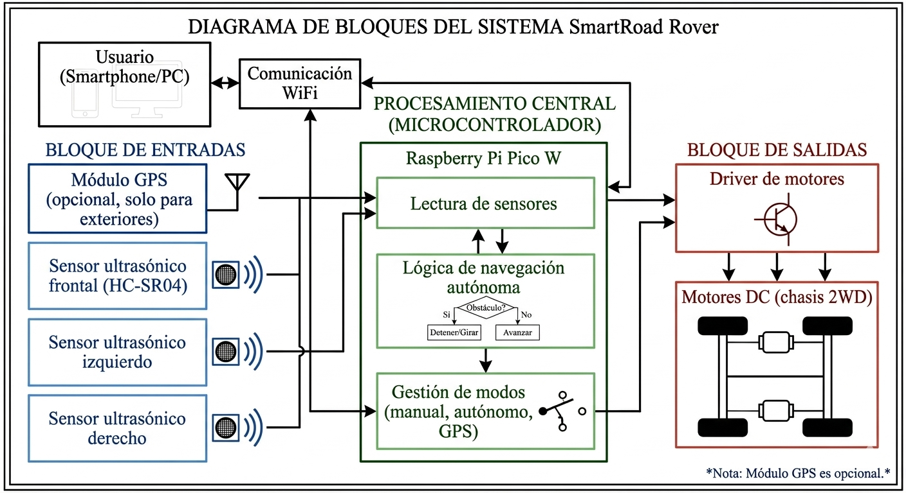
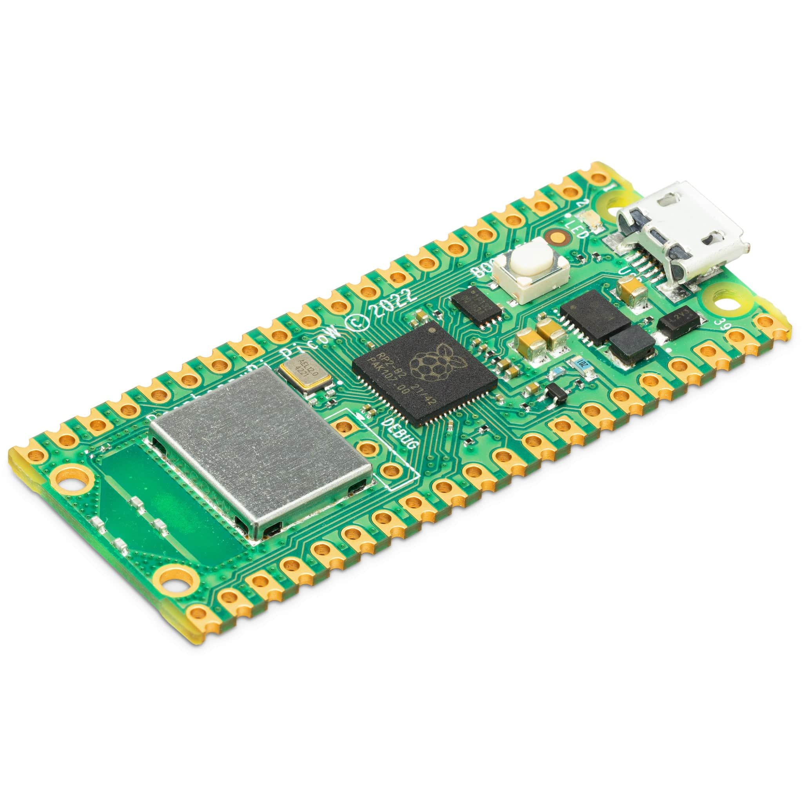
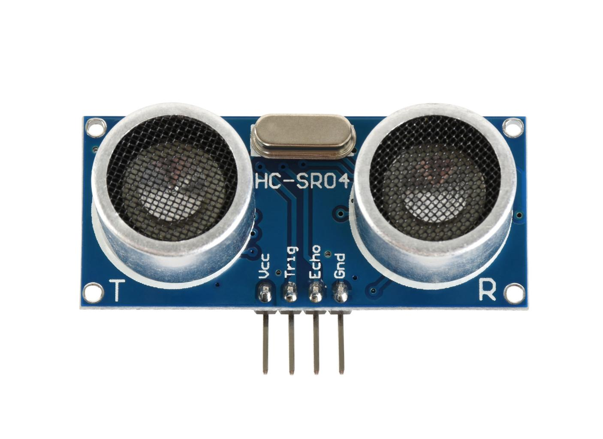
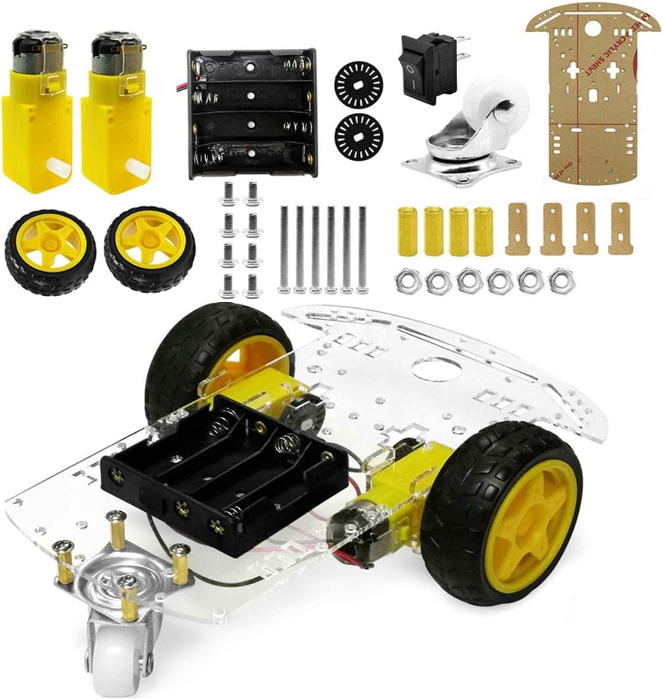

# SmartRoad Rover

Robot móvil autónomo basado en Raspberry Pi Pico W, desarrollado como proyecto final para el curso **Electrónica Digital III** — Universidad de Antioquia, 2026.

**Estudiante:** Juan Felipe Orozco Londoño

---

<p align="center">
  
</p>

---

## Descripción del proyecto

SmartRoad Rover es una plataforma robótica móvil capaz de desplazarse en un entorno, evitando obstáculos de forma autónoma y permitiendo el control por parte del usuario mediante una interfaz web.

El sistema está basado en el microcontrolador **Raspberry Pi Pico W**, que integra la adquisición de datos de sensores, el procesamiento en tiempo real y el control de actuadores, junto con comunicación inalámbrica mediante WiFi. La implementación final se realiza sobre una placa de circuito impreso (PCB) diseñada para el proyecto.

---

## Modos de operación

### Modo autónomo reactivo *(principal)*
El robot se desplaza de forma independiente usando sensores ultrasónicos HC-SR04 (frontal, izquierdo y derecho) para detectar obstáculos a menos de 20 cm y ejecutar maniobras de evasión en tiempo real. La dirección de giro se selecciona según la mayor distancia libre reportada por los sensores laterales. El ciclo de lectura y decisión opera a una frecuencia mínima de 5 Hz.

### Modo manual *(complementario)*
El usuario controla el robot desde un smartphone o PC mediante una interfaz web accesible vía WiFi, generada por el propio microcontrolador. Comandos disponibles: avanzar, retroceder, girar izquierda, girar derecha y detener. Si se pierde la conexión WiFi, el sistema detiene los motores automáticamente en un máximo de 500 ms como medida de seguridad.

### Modo autónomo asistido por GPS *(extendido)*
El robot navega hacia una coordenada objetivo en exteriores usando un módulo GPS NEO-6M, actualizando su trayectoria al menos una vez por segundo. Durante la navegación, la detección de obstáculos permanece activa. Si el módulo GPS pierde señal por más de 3 segundos, el sistema entra en modo autónomo reactivo como comportamiento de contingencia. El objetivo se considera alcanzado dentro de un radio de 1,5 m de la coordenada destino.

---

## Arquitectura del sistema

<p align="center">
  
</p>

El sistema se divide en tres bloques principales:

- **Entradas:** tres sensores ultrasónicos HC-SR04 (frontal, izquierdo, derecho) y módulo GPS NEO-6M (opcional, solo exteriores).
- **Procesamiento:** Raspberry Pi Pico W ejecuta el ciclo continuo de lectura de sensores, lógica de navegación, gestión de modos y servidor web WiFi.
- **Salidas:** driver TB6612FNG que controla los dos motores DC del chasis 2WD.

---

## Componentes principales

<p align="center">
  
  &nbsp;&nbsp;&nbsp;
  
  &nbsp;&nbsp;&nbsp;
  
</p>

| Componente | Descripción |
|---|---|
| Raspberry Pi Pico W | Microcontrolador principal con WiFi integrado |
| HC-SR04 × 3 | Sensores ultrasónicos (frontal, izquierdo, derecho) |
| TB6612FNG | Driver de motores DC |
| NEO-6M | Módulo GPS (modo extendido) |
| Chasis 2WD | Plataforma mecánica con dos motores DC |
| Batería 7,4V (18650) | Alimentación con módulo de carga y regulador step-down |
| PCB 2 capas | Implementación final del circuito |

---

## Requisitos del sistema

### Funcionales destacados

- Lectura de sensores ultrasónicos a mínimo 5 Hz
- Detección de obstáculos a menos de 20 cm
- Detención ante obstáculo frontal en menos de 300 ms (verificado por timestamps UART)
- Evasión seleccionando el lado con mayor distancia libre
- Servidor web embebido con 5 comandos de control
- Navegación GPS con actualización de trayectoria ≥ 1 Hz
- Radio de llegada al objetivo GPS: 1,5 m
- Comportamiento seguro ante pérdida de WiFi y de señal GPS

### No funcionales destacados

| ID | Descripción |
|---|---|
| RNF-1 | Ciclo autónomo reactivo completado en < 200 ms (determinista) |
| RNF-2 | Ejecución de comando manual < 100 ms desde recepción en el microcontrolador |
| RNF-4 | Operación continua mínima de 5 minutos sin fallos |
| RNF-5 | Detención automática en ≤ 500 ms ante pérdida de WiFi |
| RNF-6 | Fallback a modo reactivo ante pérdida de GPS > 3 s |
| RNF-9 | Filtrado de lecturas espurias de sensores ultrasónicos |
| RNF-10 | Software estructurado en módulos funcionales independientes |

---

## Escenario de pruebas

Las pruebas se realizan en un **único entorno exterior** de mínimo 10 m × 10 m, sobre superficie plana (pavimento o concreto):

- Área delimitada con cinta o conos en sus esquinas
- Entre 2 y 4 obstáculos de **madera o cartón rígido** (superficie frontal plana y vertical, mínimo 20 cm de alto) en posiciones fijas
- Marcador físico (cono o bandera) como referencia de la coordenada objetivo GPS, a mínimo 5 m del punto de partida

**Instrumentación:**

| Instrumento | Uso |
|---|---|
| Cinta métrica | Verificación de distancias y radio de llegada GPS |
| Terminal serial UART (portátil) | Captura de timestamps en ms para verificación de tiempos de respuesta |
| Smartphone / PC con navegador | Pruebas del modo manual vía WiFi |
| Observación directa | Validación del comportamiento físico del rover |

**Criterio de aceptación:** el sistema es válido si cumple todos los requisitos funcionales y no funcionales, mantiene estabilidad durante toda la sesión, y demuestra comportamiento seguro ante pérdida de WiFi y de señal GPS.

---

## Presupuesto estimado

| Categoría | Subtotal (COP) |
|---|---|
| Componentes electrónicos | 126.000 |
| Diseño y fabricación PCB + envío internacional | 85.000 |
| Plataforma mecánica | 53.000 |
| Sistema de alimentación | 48.000 |
| **Total estimado** | **312.000** |

Financiado con recursos propios del estudiante. El total incluye el envío internacional del fabricante de PCB (~20.000 COP).

---

## Estructura del repositorio

```
smartroad-rover/
├── docs/                         # Documentos de entrega
│   ├── Propuesta_PFinal_1000411042.pdf
│   ├── Propuesta_Ronda2_EDIII_1000411042.pdf
│   ├── Propuesta_Ronda2_EDIII_1000411042_CORREGIDO.pdf
│   ├── Presupuesto.xlsx
│   └── README.md
├── firmware/                     # Código del microcontrolador (Pico W)
│   └── README.md
├── hardware/                     # Documentación de hardware
│   └── README.md
├── images/                       # Imágenes de la documentación
│   ├── arquitectura_smartroad.png
│   ├── diagrama_bloques.png
│   ├── chassis.png
│   ├── picoW.png
│   └── ultrasonic.png
└── README.md
```

> El firmware y los archivos de hardware se irán integrando conforme avance el desarrollo del proyecto.

---

## Referencias

- Raspberry Pi Foundation — *Raspberry Pi Pico W Datasheet*
- *HC-SR04 Ultrasonic Sensor Datasheet*
- Toshiba — *TB6612FNG Motor Driver Datasheet*
- u-blox — *NEO-6M GPS Module Datasheet*
- Michael Barr — *Embedded Systems Engineering*, O'Reilly
